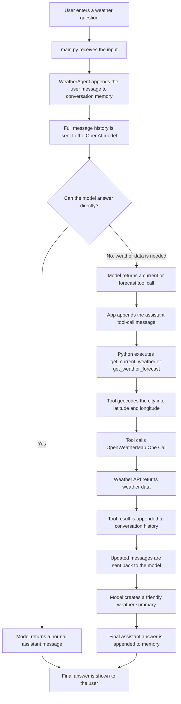

# Weather-Agent
A test-run of creating an AI agent with weather API integration.

## Setup

Install dependencies:

```bash
pip install -r requirements.txt
```

Create a `.env` file:

*** Warning: The Openweather API Key takes a couple of hours to activate

```bash
OPENAI_API_KEY=your_openai_api_key_here
OPENWEATHER_API_KEY=your_openweathermap_api_key_here
OPENAI_MODEL=gpt-4.1-mini
WEATHER_AGENT_DEBUG=false
```

## One Call
This Weather Agent uses OpenWeather's One Call subscription.
The One Call subscription is free for the first 1000 calls daily, but does require a credit card on file. 

## Docker (Preferred)

Build the image:

```bash
docker build -t weather-agent .
```

Run the container:

```bash
docker run --env-file .env -it weather-agent
```

## Verbose Debug Mode

The best way to turn on debug mode in Docker is with an environment variable in
your `.env` file:

```bash
WEATHER_AGENT_DEBUG=true
```

Then run Docker the same way as usual:

```bash
docker run --env-file .env -it weather-agent
```

This works well because Docker automatically loads every variable from `.env`
when you use `--env-file .env`. You do not need to change the Python command or
rebuild the image just to switch debug mode on or off.

When debug mode is enabled, the app prints the major steps in the agent flow:

1. `main.py` receives your input.
2. `WeatherAgent` builds the message history.
3. The first request is sent to OpenAI.
4. The model either answers directly or returns a tool call.
5. The app appends the assistant tool-call message.
6. Python parses the tool arguments.
7. The selected weather tool geocodes the city into latitude and longitude.
8. The selected weather tool calls OpenWeatherMap One Call.
9. OpenWeatherMap returns an HTTP response and JSON data.
10. The app appends the tool result to the message history.
11. The updated messages are sent back to OpenAI.
12. The model returns the final friendly answer.

API keys are not printed in debug output. The weather API URL is shown with the
API key replaced by `[hidden]`.


Run locally:

```bash
python main.py
```

Example prompts:

```text
What is the weather in Austin?
Give me the weather for New York
Give me a 5 day forecast for Chicago
What will the weather be like in Denver this weekend?
```


## How the Weather Agent Works

At a high level, this project is a small command-line AI agent. The user types a
weather question, Python sends that question to an OpenAI model, and the model
decides whether it needs current weather data or forecast weather data. If it
does, the model asks the app to call the right tool. The Python code then calls
OpenWeatherMap, gives the result back to the model, and the model writes a
friendly final answer.



Here is the same flow written out:

1. You type something like `What is the weather in Austin?`.
2. `main.py` reads your text from the terminal.
3. `main.py` passes your text to `WeatherAgent.run()`.
4. The agent appends your user message to its `messages` list.
5. The agent sends the full `messages` list to the OpenAI model, along with
   descriptions of the `get_current_weather` and `get_weather_forecast` tools.
6. The model decides whether it can answer directly or whether it needs live
   weather data.
7. For current or forecast weather questions, the model returns a tool call
   instead of guessing.
8. The app records that tool-call message in the conversation history.
9. Python runs either `get_current_weather(location)` or
   `get_weather_forecast(location, days)`.
10. The selected weather tool geocodes the city name into latitude and
   longitude.
11. The selected weather tool calls OpenWeatherMap One Call.
12. OpenWeatherMap returns JSON weather data to the Python app.
13. The app appends that tool result to the conversation history.
14. The updated messages are sent back to the OpenAI model.
15. The model reads the weather data and writes a friendly summary.
16. The agent appends the final assistant answer to memory.
17. `main.py` prints the final answer in the terminal.

### Conversation Memory

The agent keeps simple conversation memory in a Python list called `messages`.
This memory only lasts for the current terminal session. When you stop the
program, the memory is gone.

The `messages` list stores:

1. The system prompt at the beginning.
2. Every user message.
3. Every assistant response.
4. Every assistant tool-call message.
5. Every tool result message.

This is necessary because the OpenAI model is stateless between API calls. The
model does not automatically remember what happened earlier. The `messages` list
is the memory, and the app must pass it into every OpenAI API call.

That is what enables follow-up questions. For example:

```text
User: What is the weather in Chicago?
Assistant: gives Chicago weather
User: What about tomorrow?
Assistant: understands that "tomorrow" refers to Chicago
```

Tool-call messages and tool results both need to be saved. The assistant
tool-call message shows why a tool was called, and the tool result shows what
the local Python function returned. Keeping both messages in order preserves the
causal chain that the model needs for the final answer and future follow-ups.

### Why Append the Assistant Tool-Call Message?

The OpenAI model is stateless between API calls. That means it does not
automatically remember the previous request unless the app sends the previous
messages again.

The message history is the model's only memory.

When the model asks for a tool, the app must append the assistant tool-call
message before appending the tool result. This preserves the causal chain:

```text
User asked a question
-> Assistant requested a weather tool
-> Tool returned weather data
-> Assistant summarized the result
```

Without the assistant tool-call message, the model would see a tool result
without knowing why that tool was called. Keeping both messages in order helps
the model understand that the weather data is the answer to its own tool request.

### Available Weather Tools

The agent currently has two tools:

1. `get_current_weather(location)`
   - Use this for current or live weather.
   - Example: `What is the weather in Austin?`

2. `get_weather_forecast(location, days)`
   - Use this for future weather and daily forecasts.
   - The `days` value must be from 1 to 8.
   - Example: `Give me a 5 day forecast for Chicago.`

The current weather and forecast tools use OpenWeatherMap One Call API 3.0.
Because One Call requires latitude and longitude, the app first uses
OpenWeatherMap's Geocoding API to convert a city name into coordinates. The One
Call daily forecast provides up to 8 days of forecast data.
